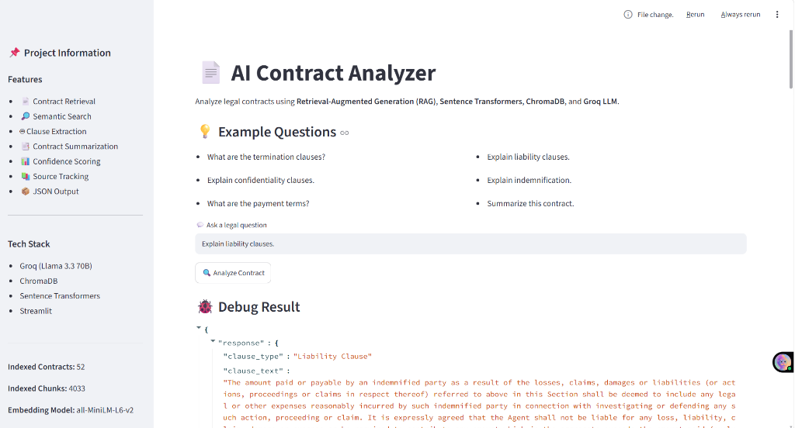
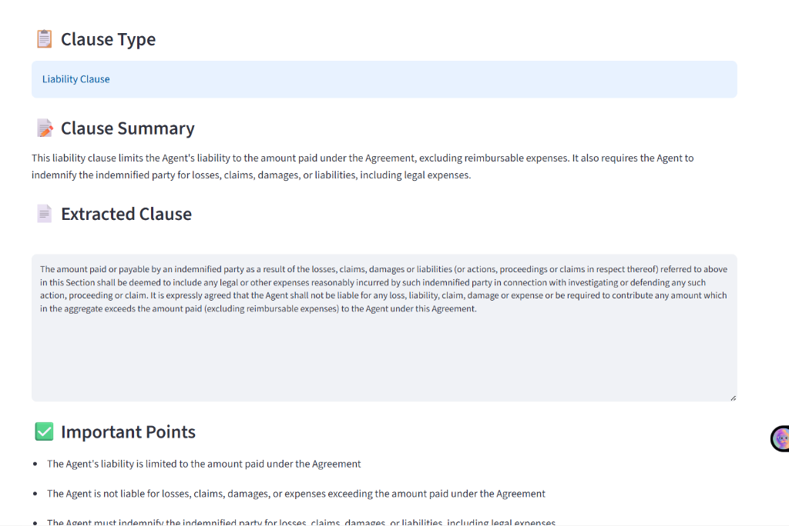

# AI Contract Analyzer

## Overview
A RAG-based legal contract analysis system that extracts legal clauses using semantic search and Groq LLM.

## Features
- PDF contract loading
- Text preprocessing
- Semantic search using ChromaDB
- Sentence Transformer embeddings
- Clause extraction
- JSON response
- Confidence scoring
- Source tracking
- Streamlit UI

## Architecture
PDF
↓
PyMuPDF
↓
Text Chunking
↓
Sentence Transformers
↓
ChromaDB
↓
Retriever
↓
Groq LLM
↓
JSON Output

## Tech Stack
- Python
- Streamlit
- ChromaDB
- Sentence Transformers
- Groq
- PyMuPDF

## Project Structure
(show your folder tree)

## Installation
pip install -r requirements.txt

## Run
streamlit run app.py

## Sample Output

## Future Improvements
- Multi-contract comparison
- Contract summarization
- PDF report generation
# Screenshots

## Home Page

---

---

## JSON Output

